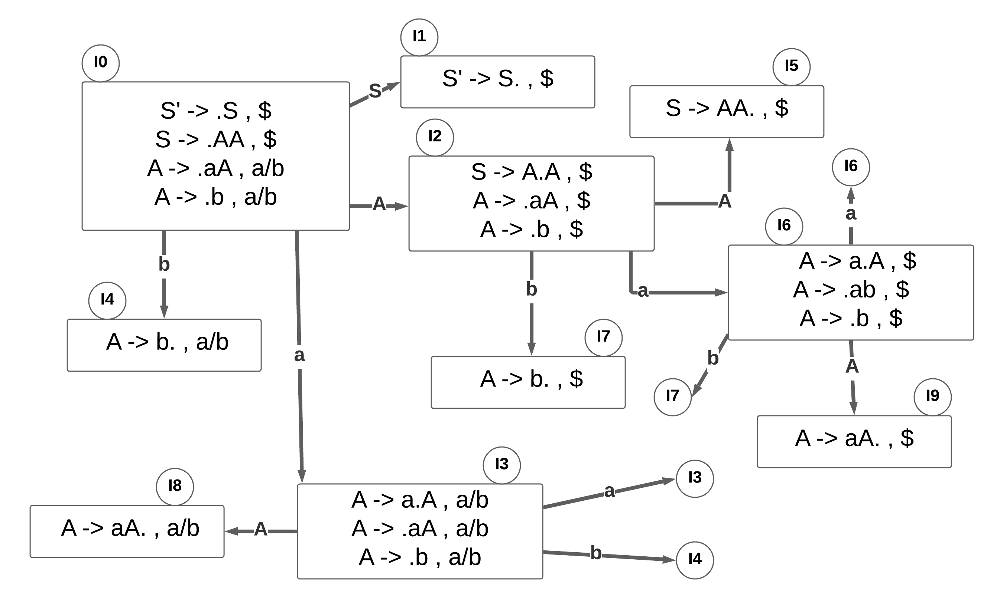

# LALR_parser

LALR parser are same as CLR parser with one difference. In CLR parser if two states differ only in lookahead then we combine those states in LALR parser. After minimisation if the parsing table has no conflict that the grammar is LALR also.

For example,
consider the grammar:

S -> AA  
A -> aA | b

Augmented grammar :

S' -> S  
S -> AA  
A -> aA | b

 

States I3 and I6 are same but differ only in lookahead. Similarly states I4 and I7 differ just in lookahead. Hence we can merge these in LALR parsing.

Its important to note that,  
1. Even though CLR parser does not have RR conflict but LALR may contain RR conflict.  
2. If number of states LR(0) = n1,  
  number of states SLR = n2,  
  number of states LALR = n3,  
  number of states CLR = n4 then,  
  n1 = n2 = n3 <= n4

